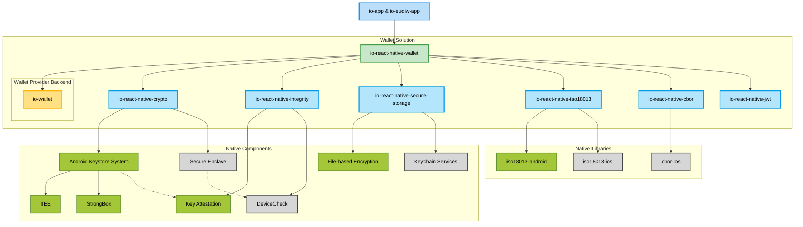

# Digital Identity Wallet - Technical Components

This repository serves as an entry point to the main packages and modules used for implementing the **Wallet Solution** within the [IO app](https://github.com/pagopa/io-app).
The Wallet Solution acts as a **Digital Identity Wallet**, compliant with the **IT-Wallet** guidelines and supporting specifications such as **OID4VCI**, **OID4VP**, **ISO/IEC 18013-5** and **ISO/IEC 18013-7**.

## 🚛 Backend

All the backend components related to the Wallet Provider are exposed in the io-wallet monorepo containing the functionalities divided by domain, such as:

- `apps/io-wallet-support-func`: Contains functionalities for assistance and support.
- `apps/io-wallet-user-func`: Contains functionalities for end users.
- `packages/io-wallet-common`: Contains shared code among the workspaces.
- `infra`: Contains infrastructure code to deploy the IO Wallet app.

📦 Related package: [`pagopa/io-wallet`](https://github.com/pagopa/io-wallet)

## 📱 Mobile Integration

The wallet is integrated into the [IO app](https://github.com/pagopa/io-app) through a react-native package that contains all the logic of the Wallet Solution.
It provides advanced functionality for:

- Receiving **digital credentials** from authorized Issuers (OID4VCI)
- Presenting credentials remotely in same and cross device flow (OID4VP and ISO/IEC 18013-7)
- Presenting credentials in proximity (ISO/IEC 18013-5)
- Support for credentials in SD-JWT and mDOC format
- Validation of the trut framework (OpenID Federation)
- Validation of the credential status
- Registration of the Wallet Instance
- Obtaining the Wallet Attestation
and much more...

📦 Related package: [`pagopa/io-react-native-wallet`](https://github.com/pagopa/io-react-native-wallet)

## 🔐 Security Architecture

The implementation adheres to strict technical and security standards, including:

### Secure Key Storage

Secure management of signature keys through platform-specific hardware-based mechanisms:

- **Android**: Uses Android Keystore, preferring **StrongBox** if available, otherwise relying on **Trusted Execution Environment (TEE)**.
- **iOS**: Keys are stored in the **Secure Enclave**.

Furthermore, this package also contains utilities for managing cryptographic material such as key parsing and X.509 certificate validation.

📦 Related package: [`pagopa/io-react-native-crypto`](https://github.com/pagopa/io-react-native-crypto)

---

### Integrity Check & Key Attestation

To ensure runtime and device integrity:

- **Android**: Uses **Play Integrity API** to detect OS and App modifications (e.g., rooting, unlocked bootloader) in addition to verifying that the app has been downloaded from the official stores.
- **iOS**: Uses **DeviceCheck** for verifying device integrity and app legitimacy.

Additionally, **key attestation** ensures that private keys are securely generated and stored in trusted environments.

📦 Related package: [`pagopa/io-react-native-integrity`](https://github.com/pagopa/io-react-native-integrity)

---

### Secure Credential Storage

Digital credentials are stored locally and securely using system-provided mechanisms:

- **Android**: Uses **File-Based Encryption (FBE)** with decryption keys tied to user authentication.
- **iOS**: Uses **Keychain Services** protected by the **Secure Enclave**, with fine-grained access control (e.g., `kSecAttrAccessibleWhenUnlocked`).

📦 Related package: [`pagopa/io-react-native-secure-storage`](https://github.com/pagopa/io-react-native-secure-storage)

---

## 📡 Proximity Presentation

Credential presentation in close proximity is implemented using **Bluetooth Low Energy (BLE)**, in compliance with **ISO/IEC 18013-5** and **ISO/IEC 18013-7**, which defines secure and authenticated communication between the wallet device and verifier.

📦 Related package: [`pagopa/io-react-native-iso18013`](https://github.com/pagopa/io-react-native-iso18013): React Native module for BLE-based proximity presentation, bridging both iOS and Android ISO 18013-5 and 18013-7 implementations.

### 🧩 Native modules

These are native implementations that handle core functionalities:

- **Android**
  - [`pagopa/iso18013-android`](https://github.com/pagopa/iso18013-android): Android implementation of ISO 18013-5 for mDL verification over BLE.
- **iOS**
  - [`pagopa/iso18013-ios`](https://github.com/pagopa/iso18013-ios): iOS implementation of ISO 18013-5 for BLE-based credential verification.

## ✏️ Credentials Data format

The following packages are used to handle the different credential formats in SD-JWT and CBOR:

📦 Related package:

- [`pagopa/io-react-native-jwt`](https://github.com/pagopa/io-react-native-jwt): React Native bridge for JWT encoding/decoding using native iOS and Android libraries.
- [`pagopa/io-react-native-cbor`](https://github.com/pagopa/io-react-native-cbor): React Native bridge for CBOR encoding/decoding using native iOS and Android libraries.

### 🧩 Native modules

These are native implementations that handle core functionalities:

- [`pagopa/cbor-ios`](https://github.com/pagopa/cbor-ios): Native iOS library to manage CBOR encoding/decoding

---

## 🇪🇺 Potential large scale pilot app

The app created within the large scale pilot Potential by Italy can be found in the  [`pagopa/io-eudiw-app`](https://github.com/pagopa/io-eudiw-app) repo and contains new features that are still being tested before being integrated into IT-Wallet.

---

## 📚 Related Repositories

Here is a list of all related repositories:

- [pagopa/io-wallet](https://github.com/pagopa/io-wallet) – Wallet Provider backend monorepo
- [pagopa/io-app](https://github.com/pagopa/io-app) – IO mobile app
- [pagopa/io-eudiw-app](https://github.com/pagopa/io-eudiw-app) – Potential EUDIW app
- [pagopa/io-react-native-wallet](https://github.com/pagopa/io-react-native-wallet) – Main package for the Wallet Solution
- [pagopa/io-react-native-crypto](https://github.com/pagopa/io-react-native-crypto) – Secure key management
- [pagopa/io-react-native-integrity](https://github.com/pagopa/io-react-native-integrity) – Device and environment integrity checks
- [pagopa/io-react-native-secure-storage](https://github.com/pagopa/io-react-native-secure-storage) – Secure credential storage
- [pagopa/io-react-native-iso18013](https://github.com/pagopa/io-react-native-iso18013) – BLE-based proximity presentation
- [pagopa/io-react-native-jwt](https://github.com/pagopa/io-react-native-jwt) – JWT encoding/decoding
- [pagopa/io-react-native-cbor](https://github.com/pagopa/io-react-native-cbor) – CBOR encoding/decoding

---

## 🛡️ Standards and Compliance

This implementation is aligned with:

- [OID4VCI](https://openid.net/specs/openid-4-verifiable-credential-issuance-1_0.html)
- [OID4VP](https://openid.net/specs/openid-4-verifiable-presentations-1_0.html)
- [ISO/IEC 18013-5](https://www.iso.org/standard/69084.html)
- [ISO/IEC 18013-7](https://www.iso.org/standard/91154.html)
- [IT-Wallet Technical Documentation](https://italia.github.io/eid-wallet-it-docs/versione-corrente/en/)
